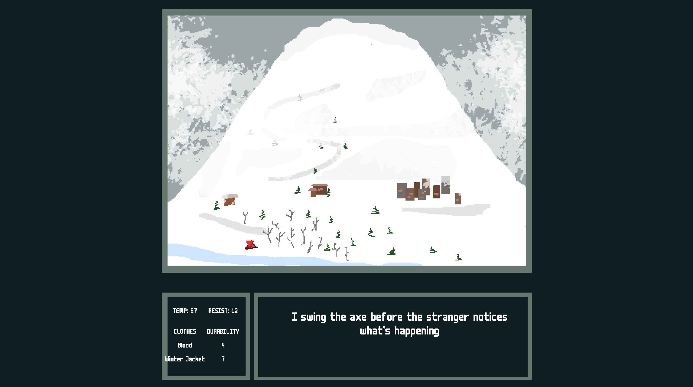

# Ice Cold Water

Author: Robert May (rzm)

Design: In a world plagued by perpetual winter, you must balance compassion and
ruthlessness to survive. All routes end with death, but if you make
compassionate choices you are rewarded with a good afterlife. Ruthlesness allows
you to survive longer, including by wearing the warm blood of your victims.
While your "humanity" stat is not shown, dynamic music indicates it.

Text Drawing: The text_draw function works dynamically by accepting the font as
well as the string to be written, passing it to Harfbuzz, and getting glyphs out
in return. The glyph info is processed by text_draw to pool and reuse glyphs
that have already been rasterized, and FreeType rasterizes those that haven't
yet been rasterized. Each glyph is then drawn in the corresponding position by
rendering a rect with the rasterized texture determining its color/transparency.

Choices: I initially chose to use Twine to write my story, and hoped to write a
pipeline to convert a twine export to C++ code. After exploring twine, I quickly
realized I could write a simplified version that was tuned to my needs without
having to write this pipeline, and since twine requires a lot of explicit coding
of variables and transitions its honestly easier to write directly in C++ than
it is in Twine anyway. The implementation I came up with stores a map of
Passages that can transition to each other, each optionally containing a
state-dependent prerequisite and an update function to modify the state when the
passage is entered, as well as its list of dialogue. The state contains
references to variables like player temperature and humanity, as well as a
generic string->bool map for storing arbitrary flags that may be used later in
the run. I chose to make this a dynamic map because I wasn't sure at first which
flags I would use, so keeping it flexible was optimal.

Screen Shot:

How To Play:

Your goal is to survive as long as possible and aim for the good ending. It
might take some investigation to find this route. You can proceed through the
dialogue by pressing ENTER and select choices with the arrow keys. If your
temperature reaches zero, you

Sources: https://managore.itch.io/m6x11 Credit to Bernardo Miranda for helping
me figure out and use text rasterization, as well as finding the font I used in
this game

This game was built with [NEST](NEST.md).
